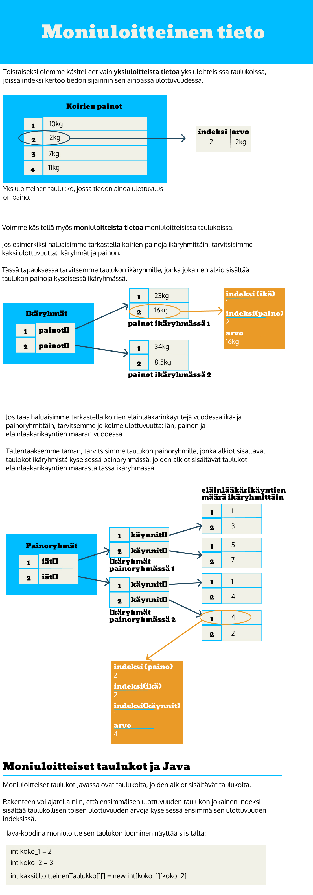
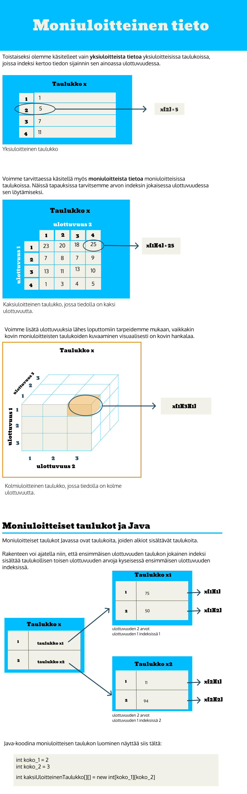

<text-box variant='learningObjectives' name='Oppimistavoitteet'>

- Tunnet menetelmiä moniulotteisen tiedon esittämiseen.
- Osaat luoda ja käyttää moniulotteisia taulukoita.

</text-box>

Tässä osassa esitellään moniuloitteista tietoa ja moniuloitteisten taulukkojen toimintaa. Vastaa ensin allaoleviin kahteen kyselyyn , ja tutustu sitten materiaaliin. Materiaalin opiskelun jälkeen sinun tulee myös vastata vielä yhteen kyselyyn.

<quiz id='b2b65686-8e50-457c-ab2c-ec3d8b01b230'></quiz>

<quiz id='a4457721-82d0-46a0-9993-d926a21386b0'></quiz>

<ab-study id="visualization_instructional_effiency_2_f19">


<!-- A1 no viewing -->

<only-for-ab-group group=1>

Toistaiseksi olemme käsitelleet vain yksiuloitteista tietoa yksiuloitteisissa taulukoissa, joissa indeksi kertoo tiedon sijainnin sen ainoassa ulottuvuudessa.

Voimme käsitellä myös moniuloitteista tietoa moniuloitteisissa taulukoissa.
Jos esimerkiksi haluaisimme tarkastella koirien painoja ikäryhmittäin, tarvitsisimme kaksi ulottuvuutta: ikäryhmät ja painon.

Tässä tapauksessa tarvitsemme taulukon ikäryhmille, jonka jokainen alkio sisältää taulukon painoja kyseisessä ikäryhmässä.
Yksittäisen painon saisimme käsiimme kahden indeksin avulla: indeksin ikäryhmätaulukossa ja indeksin painotaulukossa.

Jos taas haluaisimme tarkastella koirien eläinlääkärinkäyntejä vuodessa ikä- ja painoryhmittäin, tarvitsemme jo kolme ulottuvuutta: iän, painon ja eläinlääkärikäyntien määrän vuodessa.

Tallentaaksemme tämän, tarvitsisimme taulukon painoryhmille, jonka alkiot sisältävät taulokot ikäryhmistä kyseisessä painoryhmässä, joiden alkiot sisältävät taulukot eläinlääkärikäyntien määrästä tässä ikäryhmässä.
Vastaavasti yksittäisen koiran eläinlääkärikäyntien määrään pääsisimme käsiksi kolmen indeksin avulla: Indeksi painotaulukossa, indeksi ikätaulukossa ja indeksi eläinlääkärikäyntien määrä taulukossa.

Moniuloitteiset taulukot Javassa ovat taulukoita, joiden alkiot sisältävät taulukoita.
Rakenteen voi ajatella niin, että ensimmäisen ulottuvuuden taulukon jokainen indeksi sisältää taulukollisen toisen ulottuvuuden arvoja kyseisessä ensimmäisen ulottuvuuden indeksissä.

```java
int koko_1 = 2
int koko_2 = 3
int kaksiUloitteinenTaulukko[][] = new int[koko_1][koko_2]
```

</only-for-ab-group>

<!-- A1 viewing -->

<only-for-ab-group group=2>

Alla oleva visualisaatio käsittelee moniuloitteista tietoa ja moniuloitteisten taulukkojen toimintaa. Katsele visualisaatio läpi, ja vastaa sitten allaolevaan kyselyyn.




</only-for-ab-group>

<!-- A1 responding -->

<only-for-ab-group group=3>

<pdf-slideshow>

Allaoleva powerpoint käsittelee moniuloitteista tietoa ja moniuloitteisten taulukoiden toimintaa. Katsele ensin esitys läpi, ja vastaa sitten kyselyyn.

[a](../slideshows/moniuloitteinen_interactiveA1.pdf)

</pdf-slideshow>

</only-for-ab-group>

<!-- A2 no viewing -->

<only-for-ab-group group=4>

Toistaiseksi tällä kurssilla olemme käsitelleet vain yksiuloitteista tietoa yksiuloitteisissa taulukoissa,joissa indeksi kertoo tiedon sijainnin sen ainoassa ulottuvuudessa. Esimerkiksi voimme luoda kolmialkioisen yksiuloitteisen taulukon:
```java
int taulukko[] = new int[1,2,3]
```
Ja saamme arvon 2 tästä taulukosta sen indeksin perusteella
```java
taulukko[1]
```

Voimme tarvittaessa käsitellä myös moniuloitteista tietoa moniuloitteisissa taulukoissa. Näissä tapauksissa tarvitsemme arvon indeksin jokaisessa ulottuvuudessa sen löytämiseksi.
Esimerkiksi kaksiuloitteisesta taulukosta saattaisimme hakea arvoa 2 indekseillä
```
taulukko[1][2]
```
joka tarkoittaa sitä, että arvon 2 indeksi ulottuvuudessa 1 on 1, ja sen indeksi ulottuvuudessa 2 on 2.
Kolmiuloitteisella taulukolla indeksit voisivat olla esimerkiksi
```
taulukko[1][2][4]
```
Moniuloitteiset taulukot Javassa ovat taulukoita, joiden alkiot sisältävät taulukoita.
Rakenteen voi ajatella niin, että ensimmäisen ulottuvuuden taulukon jokainen indeksi sisältää taulukollisen 
toisen ulottuvuuden arvoja kyseisessä ensimmäisen ulottuvuuden indeksissä.

Java-koodina kaksiuloitteisen taulukon luominen näyttää siis tältä:
```java
int koko_1 = 2
int koko_2 = 3
int kaksiUloitteinenTaulukko[][] = new int[koko_1][koko_2]
```
</only-for-ab-group>

<!-- A2 viewing -->

<only-for-ab-group group=5>

Alla oleva visualisaatio käsittelee moniuloitteista tietoa ja moniuloitteisten taulukkojen toimintaa. Katsele visualisaatio läpi, ja vastaa sitten allaolevaan kyselyyn.



</only-for-ab-group>

<!-- A2 responding -->

<only-for-ab-group group=6>

Allaoleva powerpoint käsittelee moniuloitteista tietoa ja moniuloitteisten taulukoiden toimintaa. Katsele ensin esitys läpi, ja vastaa sitten kyselyyn.

<pdf-slideshow>

[a](../slideshows/moniuloitteinen_interactive_A2.pdf)

</pdf-slideshow>

</only-for-ab-group>

</ab-study>

<quiz id='b99f4d6c-93d1-4057-b8a3-f55ff1914150'></quiz>

Kaksiulotteisen taulukon läpikäynti onnistuu kahden sisäkkäisen for-toistolauseen avulla seuraavasti:

```java
int rivit = 2;
int sarakkeet = 3;
int[][] kaksiulotteinenTaulukko = new int[rivit][sarakkeet];

System.out.println("rivi, sarake, arvo");
for (int rivi = 0; rivi < kaksiulotteinenTaulukko.length; rivi++) {
    for (int sarake = 0; sarake < kaksiulotteinenTaulukko[rivi].length; sarake++) {
        int arvo = kaksiulotteinenTaulukko[rivi][sarake];
        System.out.println("" + rivi + ", " + sarake + ", " + arvo);
    }
}
```

Ylläolevan ohjelman tulostus on seuraava.

<sample-output>

rivi, sarake, arvo
0, 0, 0
0, 1, 0
0, 2, 0
1, 0, 0
1, 1, 0
1, 2, 0

</sample-output>

Yllä huomataan että `int`-tyyppisten muuttujien oletusarvo on 0.

Voimme muuttaa taulukon arvoja kuten ennenkin. Alla asetamme kolmeen kohtaan uudet arvot.

```java
int rivit = 2;
int sarakkeet = 3;
int[][] kaksiulotteinenTaulukko = new int[rivit][sarakkeet];

kaksiulotteinenTaulukko[0][1] = 4;
kaksiulotteinenTaulukko[1][1] = 1;
kaksiulotteinenTaulukko[1][0] = 8;

System.out.println("rivi, sarake, arvo");
for (int rivi = 0; rivi < kaksiulotteinenTaulukko.length; rivi++) {
    for (int sarake = 0; sarake < kaksiulotteinenTaulukko[rivi].length; sarake++) {
        int arvo = kaksiulotteinenTaulukko[rivi][sarake];
        System.out.println("" + rivi + ", " + sarake + ", " + arvo);
    }
}
```

Nyt tulostus näyttää seuraavalta:

<sample-output>

rivi, sarake, arvo
0, 0, 0
1, 0, 4
2, 0, 0
0, 1, 8
1, 1, 1
2, 1, 0

</sample-output>


<programming-exercise name='Taulukko merkkijonona' tmcname='osa11-Osa11_09.TaulukkoMerkkijonona'>

Luo tehtäväpohjaan metodi `public static String taulukkoMerkkijonona(int[][] taulukko)`, joka muodostaa parametrina saamastaan taulukosta merkkijonomuotoisen esityksen ja palauttaa sen.

Kertaa yhdeksännestä osasta StringBuilderin käyttö ennen tehtävän tekoa. Alla muutamia esimerkkejä metodin odotetusta toiminnasta.


```java
int rivit = 2;
int sarakkeet = 3;
int[][] matriisi = new int[rivit][sarakkeet];
matriisi[0][1] = 5;
matriisi[1][0] = 3;
matriisi[1][2] = 7;
System.out.println(taulukkoMerkkijonona(matriisi));
```

<sample-output>

050
307

</sample-output>

```java
int[][] matriisi = {
    {3, 2, 7, 6},
    {2, 4, 1, 0},
    {3, 2, 1, 0}
};

System.out.println(taulukkoMerkkijonona(matriisi));
```

<sample-output>

3276
2410
3210

</sample-output>

</programming-exercise>


<programming-exercise name='Taikaneliö (4 osaa)' tmcname='osa11-Osa11_10.Taikanelio'>


<a href="https://fi.wikipedia.org/wiki/Taikaneli%C3%B6" target="_blank">Taikaneliöt</a> ovat kokonaisluvuista järjestettyjä neliöitä, joiden jokaisen rivin, sarakkeen ja lävistäjän summa on sama. Harjoitellaan taulukoiden käyttöä taikaneliöiden yhteydessä.

<br/>

Ohjelmassa on annettu osittain toteutettu luokka `Taikanelio`, jota voidaan käyttää lähtökohtana. Tehtävänäsi on ensin lisätä luokkaan toiminnallisuutta, jolla tarkistetaan onko neliö taikaneliö. Tämän jälkeen toteutat algoritmin taikaneliön luomiseen.


<h2>Rivien summat</h2>

Luokassa Taikanelio on valmiina metodi `public ArrayList<Integer> rivienSummat()`, joka palauttaa tyhjän ArrayList-olion. Muuta metodin toiminnallisuutta siten, että se palauttaa listan, jossa on jokaisen taikaneliön rivin summa.

Esimerkiksi seuraavanlaisella taikaneliöllä rivienSummat-metodin pitäisi palauttaa lista, jossa on luvut `15, 15, 15`.

```
8 1 6
3 5 7
4 9 2
```

Vaikka taikaneliö ei olisi "oikea" taikaneliö, tulee rivien summat silti palauttaa. Allaolevalla esimerkillä rivienSummat-metodin pitäisi palauttaa lista, jossa on luvut `6, 15, 24`.


```
1 2 3
4 5 6
7 8 9
```


<h2>Sarakkeiden summat</h2>

Luokassa Taikanelio on valmiina metodi `public ArrayList<Integer> sarakkeidenSummat()`, joka palauttaa tyhjän ArrayList-olion. Muuta metodin toiminnallisuutta siten, että se palauttaa listan, jossa on jokaisen taikaneliön sarakkeen summa.

Esimerkiksi seuraavanlaisella taikaneliöllä sarakkeidenSummat-metodin pitäisi palauttaa lista, jossa on luvut `15, 15, 15`.

```
8 1 6
3 5 7
4 9 2
```

Vaikka taikaneliö ei olisi "oikea" taikaneliö, tulee sarakkeiden summat silti palauttaa. Allaolevalla esimerkillä sarakkeidenSummat-metodin pitäisi palauttaa lista, jossa on luvut `12, 15, 18`.


```
1 2 3
4 5 6
7 8 9
```


<h2>Lävistäjien summat</h2>

Toteuta seuraavaksi metodi `public ArrayList<Integer> lavistajienSummat()`, joka palauttaa listan, jossa on taikaneliön lävistäjien summat.

Esimerkiksi seuraavanlaisella taikaneliöllä lavistajienSummat-metodin pitäisi palauttaa lista, jossa on luvut `15, 15` (8 + 5 + 2) ja (4 + 5 + 6).

```
8 1 6
3 5 7
4 9 2
```

Vaikka taikaneliö ei olisi "oikea" taikaneliö, tulee lävistäjien summat silti palauttaa. Allaolevalla esimerkillä lavistajienSummat-metodin pitäisi palauttaa lista, jossa on luvut `15, 15` (1 + 5 + 9) ja (7 + 5 + 3).

```
1 2 3
4 5 6
7 8 9
```


<h2>Taikaneliön luominen</h2>

Huom! Tämä tehtävä on melko visainen, kannattanee palauttaa edelliset osat ennen tämän aloitusta.

Taikaneliön pystyy myös luomaan. Tutustutaan <a href="https://en.wikipedia.org/wiki/Siamese_method" target="_blank">Siamese method</a>-menetelmään, jonka avulla voidaan luoda parittomien lukujen kokoisia taikaneliöitä.

<br/>

Siamese method -algoritmi toimii siten, että numero yksi asetetaan ylimmän rivin keskimmäiseen sarakkeeseen. Tämän jälkeen siirrytään yksi ylös ja yksi oikealle ja asetetaan luku kaksi. Tämän jälkeen taas siirrytään yksi ylös ja yksi oikealle, ja asetetaan luku kolme jne.

Lukujen lisäämiseen liittyy kaksi sääntöä:

1. Jos siirtymä tapahtuu siten, että mennään taikaneliön alueen ulkopuolelle, hypätään toiselle laidalle. Jos siis mennään "oikealta yli" mennään vasempaan laitaan ja jos mennään "ylhäältä yli" mennään alalaitaan.
2. Jos kohdassa on jo luku, ei mennäkään ylös ja oikealle, vaan astutaan yksi askel alaspäin.

Käy katsomassa yllä kuvatun algoritmin visualisaatio Wikipedian sivulta <a href="https://en.wikipedia.org/wiki/Siamese_method" target="_blank">Siamese method</a>.

<br/>

Toteuta luokkaan `Taikaneliotehdas` metodi `luoTaikanelio` joka palauttaa taikaneliön jonka sivun pituus annetaan parametrina. Metodin tarvitsee toimia vain tilanteissa, missä neliön leveys on pariton luku.

</programming-exercise>


<text-box variant='hint' name='Taulukko vs. Hajautustaulu'>

Taulukon toiminnallisuutta vastaavan toiminnallisuuden pystyy toteuttamaan hajautustaulun avulla. Eikö hajautustaulun käyttö olisi yleisesti ottaen parempi vaihtoehto, sillä sitä ei esimerkiksi tarvitse kasvattaa lainkaan?

Kun hajautustaulusta haetaan tietoa tietyllä avaimella, metodin hashCode perusteella selvitetään paikka, mistä tietoa haetaan. Samassa paikassa voi olla useampi arvo (listassa), jolloin haettavaa avainta verrataan jokaiseen listalla olevaan arvoon equals-metodia käyttäen. Kun taulukosta haetaan arvoa tietyllä avaimella -- eli indeksillä -- ei vastaavaa toiminnallisuutta tarvitse tehdä. Taulukossa joko on arvo tai arvoa ei ole. Taulukkoon liittyy pieni tehokkuushyöty ohjelman suorituskyvyn kannalta.

Tämä tehokkuushyöty kuitenkin tulee lisääntyneen virhealttiuden sekä työmäärän kustannuksella. Hajautustauluun on valmiiksi toteutettuna sisäisen taulukon kasvattaminen ja sen toiminnallisuutta on testattu hyvin laajasti. Taulukkoa käytettäessä tällaista etua ei ole -- uutta toiminnallisuutta toteuttaessa saattaa päätyä virheisiin, mikä kasvattaa työmäärää. Virheet ovat toki luonnollinen osa ohjelmistokehitystä.

Kun ajattelemme muistin käyttöä, hajautustaululla voi olla -- tapauksesta riippuen -- pieni etu. Kun taulukko luodaan, muistista varataan heti tila koko taulukolle. Mikäli taulukon jokaiseen indeksiin ei tarvitse lisätä tietoa, on osa tästä tiedosta varattuna turhaan. Hajautustaululla taas tällaista muistin varaamista ei ennakkoon tehdä -- hajautustaulun kokoa kasvatetaan tarvittaessa.

</text-box>

